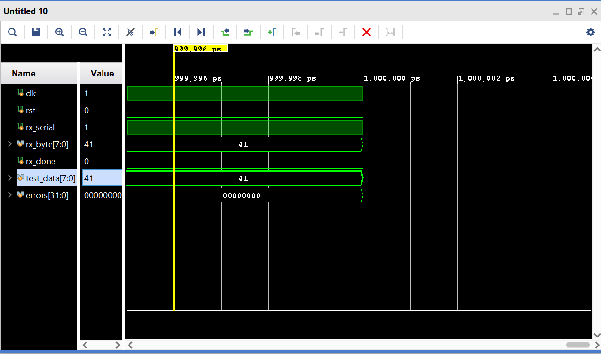
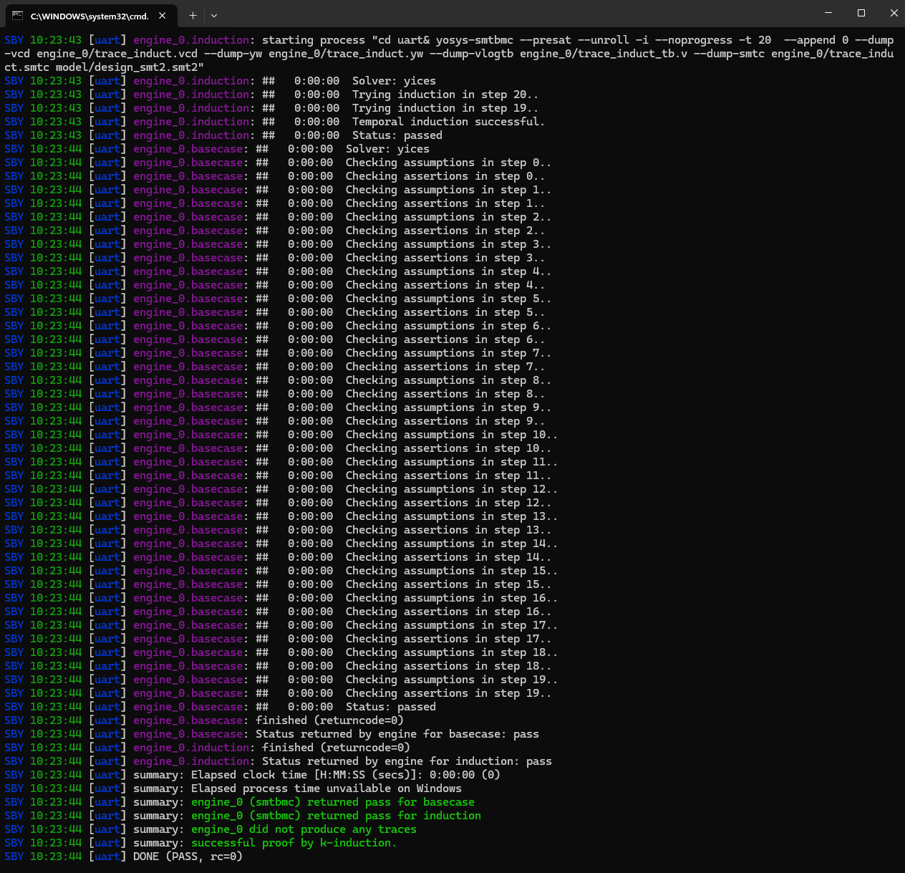
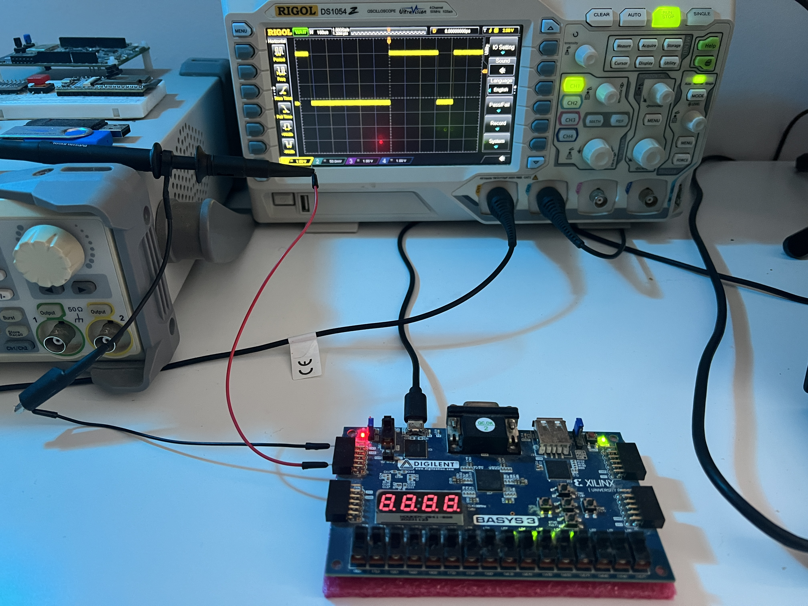

# Heterogeneous FPGA Signal Processing Platform

## 🚀 Overview
This project explores a multi-stage system architecture using a **Xilinx Artix-7 (Basys 3)** FPGA as a central processing hub. The platform integrates external microcontrollers (ESP32 and STM32) to perform real-time signal analysis across both digital (Wi-Fi) and physical (vibration) domains.

The goal is not just functionality, but **deterministic behavior**, verifiability, and clean hardware–software boundaries.

### Core Architecture
* **Hub:** Basys 3 FPGA (RTL)
    * *Role:* Data aggregation, packet parsing, filtering, and visualization.
* **Cyber Agent:** ESP32 (C++)
    * *Role:* Network telemetry — Wi-Fi packet sniffing and raw traffic streaming.
* **Physical Agent:** STM32 (C)
    * *Role:* DSP frontend — high-speed accelerometer sampling and preprocessing.

---

## 🗺️ Project Roadmap

### Phase 1: The Foundation — Reliable Communication
*Goal: Establish a robust UART physical layer and verify it end-to-end.*

- [x] **Milestone 1:** RTL design of UART receiver (FSM-based) in SystemVerilog
- [x] **Milestone 2:** Formal verification using SymbiYosys (bounded model checking, depth = 20)
- [x] **Milestone 3:** SystemVerilog constrained-random verification (CRV)
- [x] **Milestone 4:** Hardware validation  
  *Verified 9600-baud timing on Rigol DS1054Z oscilloscope.*
- [ ] **Milestone 4.5:** 7-segment display driver (hex visualization)

### Phase 2: The "Hacker" Dashboard — Cyber Signals
*Goal: Inspect and visualize live wireless traffic.*

- [ ] **Milestone 5:** ESP32 raw packet streaming
- [ ] **Milestone 6:** FPGA-side custom packet parser
- [ ] **Milestone 7:** Traffic density visualization (LED breathing patterns)

### Phase 3: The DSP Monitor — Physical Signals
*Goal: Real-time vibration analysis and basic frequency extraction.*

- [ ] **Milestone 8:** STM32 high-speed sensor streaming (~1 kHz)
- [ ] **Milestone 9:** Verilog moving-average filter (noise reduction)
- [ ] **Milestone 10:** Zero-crossing frequency detector

---

## 📸 Proof of Concept

### Phase 1: Physical Layer (UART) Verification
The UART receiver was validated using layered verification across RTL, simulation, and hardware.

**1. Simulation (Data Integrity)**  
*Correct start/data/stop handling and byte reconstruction verified via simulation (Vivado).*  

*(Example: Byte `0x41` ('A') captured with no frame errors.)*

**2. Formal Verification (Logic Safety)**  
* **Tool:** SymbiYosys  
* **Result:** FSM safety and liveness properties proven using bounded model checking (depth = 20); no illegal state transitions possible.

**3. Hardware Validation (Physical Timing)**  
* **Setup:** Rigol DS1054Z probing FPGA Pmod pins.
* **Capture 1:** ASCII `'p'` (0x70) — ~104 µs bit width (9600 baud).

  
* **Capture 2:** ASCII `'1'` (0x31) — verified LSB-first ordering.

---

## 🛠️ Tech Stack

* **Hardware:** Xilinx Basys 3 (Artix-7), ESP32-C3, STM32F4
* **RTL & Verification:** SystemVerilog, SymbiYosys, Vivado Simulator
* **Firmware:** C/C++ (HAL / LL drivers)
* **Instrumentation:** Rigol DS1054Z Oscilloscope, Tera Term
